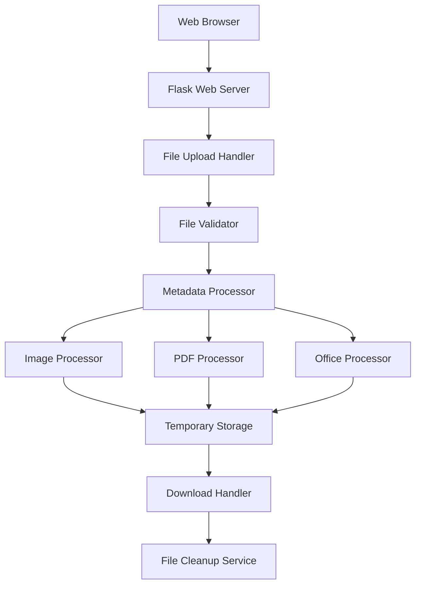

# Design Document

## Overview

ファイルメタデータ削除Webアプリケーションは、ユーザーがアップロードしたファイルからメタ情報を安全に削除し、プライバシーを保護するためのWebサービスです。Python Flask フレームワークをベースとし、様々なファイル形式に対応したメタデータ削除機能を提供します。

## Architecture

### System Architecture



### Technology Stack

- **Backend**: Python Flask
- **Python Environment**: Standard venv for virtual environment management
- **Package Management**: pip for dependency installation
- **File Processing**: 
  - Images: Pillow (PIL)
  - PDF: PyMuPDF (fitz)
  - Office: python-docx, openpyxl, python-pptx
- **Frontend**: HTML5, CSS3, JavaScript (Vanilla)
- **Storage**: Temporary file system storage
- **Security**: Werkzeug secure filename, file type validation

## Components and Interfaces

### 1. Web Interface Layer

**FileUploadComponent**
- 責任: ファイルアップロード UI とドラッグ&ドロップ機能
- インターフェース:
  ```javascript
  - uploadFiles(files: FileList): Promise<UploadResponse>
  - validateFileTypes(files: FileList): boolean
  - showProgress(progress: number): void
  ```

**FileNameEditorComponent**
- 責任: ファイル名変更インターフェース
- インターフェース:
  ```javascript
  - editFileName(originalName: string): string
  - validateFileName(name: string): boolean
  - preserveExtension(name: string, extension: string): string
  ```

### 2. Application Layer

**FileUploadHandler**
- 責任: ファイルアップロードの受信と初期検証
- インターフェース:
  ```python
  def upload_files(request: Request) -> UploadResponse:
  def validate_file_size(file: FileStorage) -> bool:
  def validate_file_type(file: FileStorage) -> bool:
  ```

**MetadataProcessorService**
- 責任: ファイル種別に応じたメタデータ削除の調整
- インターフェース:
  ```python
  def process_file(file_path: str, file_type: str) -> ProcessResult:
  def get_processor(file_type: str) -> BaseProcessor:
  def generate_processing_report(result: ProcessResult) -> Report:
  ```

### 3. Processing Layer

**BaseProcessor (Abstract)**
- 責任: メタデータ削除処理の基底クラス
- インターフェース:
  ```python
  def remove_metadata(file_path: str) -> ProcessResult:
  def get_metadata_info(file_path: str) -> MetadataInfo:
  def validate_file(file_path: str) -> bool:
  ```

**ImageProcessor**
- 責任: 画像ファイルのEXIF・メタデータ削除
- インターフェース:
  ```python
  def remove_exif_data(image_path: str) -> str:
  def remove_color_profile(image_path: str) -> str:
  def preserve_image_quality(image_path: str) -> str:
  ```

**PDFProcessor**
- 責任: PDFファイルのメタデータ削除
- インターフェース:
  ```python
  def remove_pdf_metadata(pdf_path: str) -> str:
  def remove_annotations(pdf_path: str) -> str:
  def clean_document_info(pdf_path: str) -> str:
  ```

**OfficeProcessor**
- 責任: Office文書のメタデータ削除
- インターフェース:
  ```python
  def remove_document_properties(doc_path: str) -> str:
  def remove_comments_and_revisions(doc_path: str) -> str:
  def clean_hidden_data(doc_path: str) -> str:
  ```

### 4. Infrastructure Layer

**FileStorageService**
- 責任: 一時ファイルの管理と自動削除
- インターフェース:
  ```python
  def store_temporary_file(file: FileStorage) -> str:
  def cleanup_files(session_id: str) -> None:
  def schedule_cleanup(file_path: str, delay: int) -> None:
  ```

**DownloadService**
- 責任: 処理済みファイルのダウンロード提供
- インターフェース:
  ```python
  def prepare_download(file_path: str, custom_name: str) -> DownloadInfo:
  def create_zip_archive(file_paths: List[str]) -> str:
  def serve_file(file_path: str) -> Response:
  ```

## Data Models

### ProcessResult
```python
@dataclass
class ProcessResult:
    success: bool
    original_file_path: str
    processed_file_path: str
    metadata_removed: List[str]
    original_size: int
    processed_size: int
    error_message: Optional[str] = None
```

### MetadataInfo
```python
@dataclass
class MetadataInfo:
    file_type: str
    detected_metadata: Dict[str, Any]
    metadata_count: int
    has_sensitive_data: bool
```

### UploadResponse
```python
@dataclass
class UploadResponse:
    session_id: str
    uploaded_files: List[FileInfo]
    total_files: int
    success: bool
    errors: List[str]
```

### FileInfo
```python
@dataclass
class FileInfo:
    original_name: str
    file_id: str
    file_type: str
    size: int
    status: str  # 'uploaded', 'processing', 'completed', 'error'
```

## Error Handling

### Error Categories

1. **File Validation Errors**
   - Unsupported file type
   - File size exceeds limit
   - Corrupted file

2. **Processing Errors**
   - Metadata extraction failure
   - File corruption during processing
   - Insufficient disk space

3. **System Errors**
   - Server timeout
   - Memory limitations
   - Network interruption

### Error Response Format
```python
@dataclass
class ErrorResponse:
    error_code: str
    error_message: str
    user_message: str
    suggested_action: str
    timestamp: datetime
```

### Error Handling Strategy

- **Graceful Degradation**: 部分的な処理失敗時も成功した部分を提供
- **User-Friendly Messages**: 技術的エラーをユーザーにわかりやすく説明
- **Logging**: すべてのエラーを適切にログ記録
- **Cleanup**: エラー発生時も一時ファイルを確実に削除

## Testing Strategy

### Unit Testing
- 各プロセッサーの個別機能テスト
- ファイル検証ロジックのテスト
- エラーハンドリングのテスト

### Integration Testing
- ファイルアップロードから削除までの完全フロー
- 複数ファイル処理のテスト
- セッション管理とクリーンアップのテスト

### End-to-End Testing
- ブラウザ自動化テストによるUI操作
- 様々なファイル形式での処理テスト
- パフォーマンステスト（大容量ファイル、多数ファイル）

### Security Testing
- ファイルアップロード攻撃の防御テスト
- 一時ファイルの適切な削除確認
- セッションセキュリティのテスト

### Test Data
- 各ファイル形式のサンプルファイル（メタデータ付き）
- 破損ファイルのテストケース
- 大容量ファイルのテストケース
- 悪意のあるファイルのテストケース